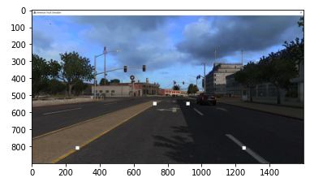
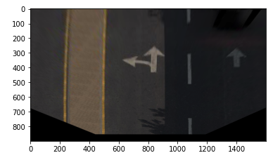
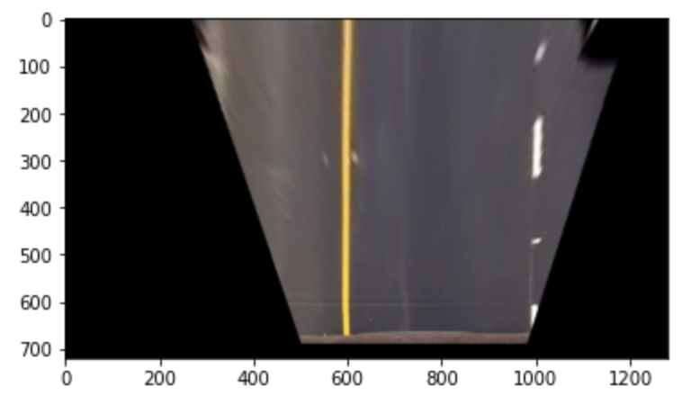
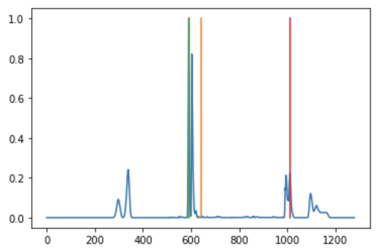
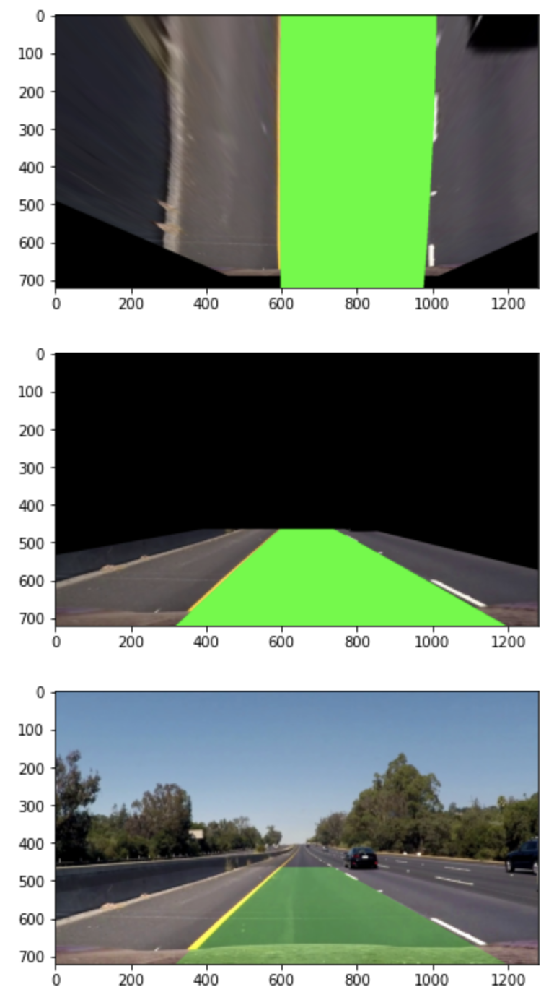

# Traditional Lane Detection


# Project Workflow

- Camera calibration using chessboard
- Perspective transformation to a bird’s eye view
- Filtering with Hough transform, Canny edge, Hue Saturation Light (HSL)
- Lane finding with histogram and sliding window
- Finding lane position, and curvature

## 1. Camera calibration using chessboard

카메라 왜곡은 카메라를 사용할 때 생기는 현상입니다. 흔히 스마트폰의 광각을 사용할 때 쉽게 접하실 수 있는 현상입니다. 이러한 영상 왜곡은 시각적 문제 뿐만 아니라 카메라 왜곡의 현상에는 Radial Distortion(방사 왜곡)과 Tangential Distortion(접선 왜곡)이 존재합니다.

**방사 왜곡**

방사왜곡은 왜곡이 중심에서의 거리에 의해 결정되는 왜곡입니다.

**접선 왜곡**

이미지 촬영 렌즈가 영상의 평면과 완벽하게 평행하지 않기 때문에 접선 왜곡이 발생합니다. 그렇기에, 영상 혹은 이미지의 일부 영역은 보이는 것보다, 예상보다 더 가까워보일 수 있습니다.

이 문서에서는 두 왜곡에 대한 자세한 수식은 생략하였습니다. 
자세한 수식은 https://docs.opencv.org/3.4.3/dc/dbb/tutorial_py_calibration.html 를 참고 부탁드립니다.


## 2. Perspective transformation to a bird’s eye view

차량의 카메라에서 보는 이미지는 전방의 도로 이미지가 원근감을 가지고 있음을 알 수 있습니다.



원근감이 느껴지는 위의 이미지를 원근감이 없는 이미지로 변환해야 합니다.

이번 프로젝트에서 차선의 위치를 직접 행렬형태로 소스를 잡고 일직선으로 만들 좌표를 만듭니다.
openCV 에서 제공하는 ```getPerspectiveTransform(src, target)``` 함수를 활용하여 변환 행렬을 만들겠습니다.


```python
src = np.array([
                [725, 550],
                [270, 810],
                [920, 550],
                [1250, 810]
], dtype=np.float32)

target = np.array([
                   [495, 0],
                   [495, 810],
                   [1080, 0],
                   [1080, 810]
], dtype=np.float32)


M= cv2.getPerspectiveTransform(src, target)
```





이를 통해 우리는 Bird Eye View 로 변환할 수 있는 행렬을 얻어냈습니다.


## 3. Filtering

가장 중요한 필터링 과정을 진행합니다. 필터링은 이후 차선의 곡률을 구할 때 사용할 슬라이딩 윈도우에 쓸 binray image를 만들기 위해 거치는 과정입니다. 
필터링을 통해 이미지의 노이즈를 줄이고, 차선 인식 정확도를 높이기 위해서 여러가지 방법을 거치게 됩니다.

우선 관심 영역(Region Of Interest)를 설정해줍니다.

```python
def region_of_interest(img, vertices=None):
    imshape= img.shape
    img_h = img.shape[0]
    img_w = img.shape[1]
    
    if vertices is None:
        vertices = np.array([
            [(100, img_h), (1200, img_h), (img_w / 2, img_h / 2)]
        ], dtype=np.int32)
        
    #defining a blank mask to start with
    mask = np.zeros_like(img)   
    
    #defining a 3 channel or 1 channel color to fill the mask with depending on the input image
    if len(img.shape) > 2:
        channel_count = img.shape[2]  # i.e. 3 or 4 depending on your image
        ignore_mask_color = (255,) * channel_count
    else:
        ignore_mask_color = 255
        
    #filling pixels inside the polygon defined by "vertices" with the fill color    
    cv2.fillPoly(mask, vertices, ignore_mask_color)
    
    #returning the image only where mask pixels are nonzero
    masked_image = cv2.bitwise_and(img, mask)
    return masked_image
```

우선 주어진 영상만 대상으로 관심 영역을 일반적으로 설정해두고 bird's eye view 로 변환을 해줄 수 있습니다.



이후 제대로 filtering에 진행할 수 있습니다.


### Canny Edge

```python
def filter(img):
    img = np.copy(img)
    gray = cv2.cvtColor(img, cv2.COLOR_RGB2GRAY)
    
    blur = cv2.GaussianBlur(gray, (3,3), 0)
    
    # canny edge detection
    canny_min = 50
    canny_max = 150
    canny = cv2.Canny(blur, canny_min, canny_max)

    return canny
```

주어진 이미지에 대해서 외곽선을 인식하기 위해 canny filter 를 적용했습니다.

이 함수는 주어진 이미지에 대해서 2개의 임계값을 활용하여 외곽선을 검출하는데 사용합니다. 두 임계값의 차이에 따라 외곽선 검출 정도가 달라지게 됩니다. 여기에선 약 3배정도의 차이를 가지고 있는 50과 150 값을 적용했습니다.

함수의 자세한 수학적 내용은 생략하겠습니다.


## 4. Lane finding with histogram and sliding window

이미지의 관심 영역에 대하여 y축 합에 대한 히스토그램을 그린 뒤 그 값이 가장 큰 값을 차선으로 인식하기로 결정했습니다. 

```python
hist = np.sum(image, axis=0)
plt.plot(hist / hist.max())

plt.plot([640, 640], [0, 1]) # center

leftx_base = np.argmax(hist[:640])
rightx_base = np.argmax(hist[640:]) + 640

plt.plot([leftx_base, leftx_base], [0, 1]) # left line
plt.plot([rightx_base, rightx_base], [0, 1]) # right line
plt.show()
```



중간값을 기준으로 좌측에서 max, 우측에서 max 값으로 차선으로 가정하고 있음을 확인할 수 있습니다. 이 값을 기준으로 슬라이딩 윈도우를 그리게 됩니다. 


## 5. Finding lane position, and curvature

특정 높이를 갖는 윈도우 내에서 최댓값을 갖는 x를 찾고, 그 값이 해당 윈도우 내의 차선이라고 가정할 수 있습니다. 우리는 다음 높이에 대해 윈도우 내에서 최댓값을 찾고, 변화량 delta를 구하여 차선의 위치를 갱신하는 함수를 작성할 수 있습니다.

```python
binary_viz = np.dstack((image, image, image))

windowWidth = 120
windowHeight = 72

left_current = leftx_base
right_current = rightx_base

left_delta = 0
right_delta = 0

# 10개의 슬라이딩 윈도우 작성
for x in range(720//windowHeight):
    # 2번의 fitWindow 과정 존재. 보정을 위해 다시 그립니다.
    _, left_current, right_current, left_delta, right_delta = \
        fitWindow(image, x, binary_viz, left_current, right_current, left_delta, right_delta, \
                  windowWidth=windowWidth, windowHeight=windowHeight, thresh=10)
    binary_viz, left_current, right_current, left_delta, right_delta = \
        fitWindow(image, x, binary_viz, left_current, right_current, left_delta, right_delta, \
                  windowWidth=windowWidth, windowHeight=windowHeight, thresh=10)


```

윈도우가 그려지고 다음 윈도우 보정을 위해 2번의 fitWindow 함수가 쓰였습니다.

이를 통해 차선을 검출하고 실제 이미지 위에 overlay 한 경우 다음과 같은 결과를 볼 수 있습니다.




# Reference

- https://blog.naver.com/hirit808/221486800161
- https://docs.opencv.org/3.4.3/dc/dbb/tutorial_py_calibration.html
- https://darkpgmr.tistory.com/31
- 

# Resource

- https://blog.naver.com/hirit808/221486800161